# Hashtable 

Данная лабораторная работа нацелена на изучение такой структуры данных, как хештаблицы([Hash table](https://en.wikipedia.org/wiki/Hash_table)). 

## Введение 

Изучение данной структуры производилось в несколько этапов

- Изучение хеш функций, выбор наиболее подходящей. 
- Оптимизация поиска элементоe при помощи средств языка C и его компилятора.
- Ручная оптимизация с использованием следующих средств:
    - Intel Intrinsics, [здесь](https://www.intel.com/content/www/us/en/docs/intrinsics-guide/index.html#) представлена документация. 
    - Asm-вставки.
    - Написание отдельных функций на Assembler.

Заглядывая вперед, конечный прирост получился в **1.71 раза** в общем случае. Частные случаи(например, строки до 16) рассмотрены не были, так как одной из подзадач было создание хештаблицы с удобным интерфейсом, в котором не будет какой-либо зависимости от входных данных.

## Part 1: Выбор хеш функции.
Для изучения нашим преподавателем Ильей Рудольфовичем Дединским были представлены следующие функции:
- AlwaysZero(значение хеш функции всегда равно нулю).
- Ascii код первой буквы.
- Длина слова
- "Коварная" сумма ASCII кодов.
- ROL и ROR хеши. 
- GNU hash 
- CRC32 

Для каждой функции изучалась функция LoadFactor(номер bucket). Размер таблицы выбирался таким образом, чтобы средний LoadFactor был порядка $\approx 10$. Также рассматривался такой параметр как дисперсия,
так как в идеальном случае хеш функция должна иметь равномерное распределение для входных данных. Все измерения записывались в удобный для чтения JSON формат. Не углубляясь в подробности, отметим, что для всех 
расчетов был использован язык Python c его многочисленными библиотеками.

Заполнением таблицы стало содержание одной из настоятельно рекомендуемых к прочтению книг в нашем курсе "Компьютерные системы. Архитектура и программирование".

Для построения графиков была использована одна из Python библиотек Matplotlib. На рисунках(1-3) представленны полученные результаты построений.

<div align="center">
  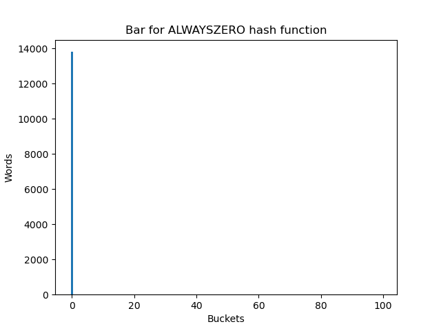
  <p><em>Рис 1. Всегда ноль </em></p>
  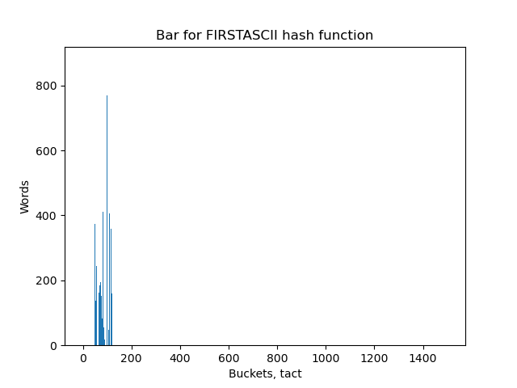
  <p><em>Рис 2. Первый ASCII код</em></p>
  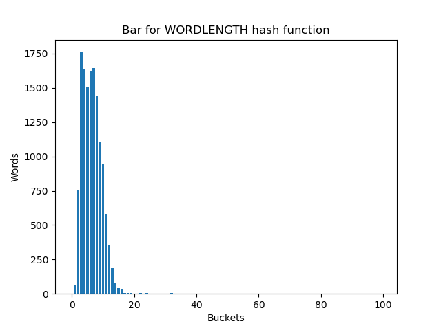
  <p><em>Рис 3. Длина слова</em></p>
</div>

Предыдущие хеш функции показали неудовлетворительные результаты. Из графиков можно понять, что такие хеш функции совершенно не удовлетворяют условиям описанными ранее.

Интересный результат показала противоречивая функция "сумма ASCII кодов". При количестве корзин равным порядка 500 распределение выглядит подходящим для наших целей(рис. 4).

<div align="center">
  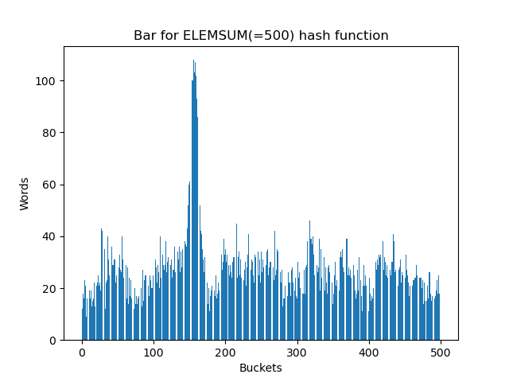
  <p><em>Рис 4. Сумма ASCII при количестве корзин порядка 500 </em></p>
</div>

Однако при бОльших значениях, например, порядка 3000, распределение выглядело совсем иначе(рис. 5).

<div align="center">
  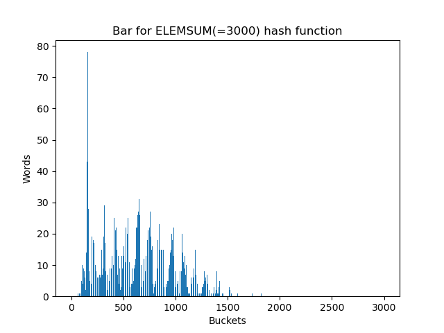
  <p><em>Рис 5. Сумма ASCII при количестве корзин порядка 3000 </em></p>
</div>

Интересно отметить, что "горбики" - следствие того, что в естественной речи диапазон букв сосредоточен в некоторой области. Если бы текст был набором случайных символов, 
распределение не имело такой характерной особенности в виде "горбиков". Эта функция, в целом, может быть использована, если в хеш таблице записано не очень большое количество слов. Одним из преимуществ данной функции является ее скорость вычисления и относительно неплохая работа при небольшом количестве корзин.

На рисунках (6-9) представлены графики остальных распределений. 


<div align="center">
  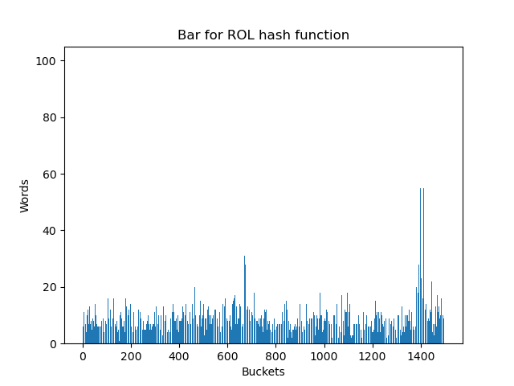
  <p><em>Рис 6. Rol hash </em></p>
  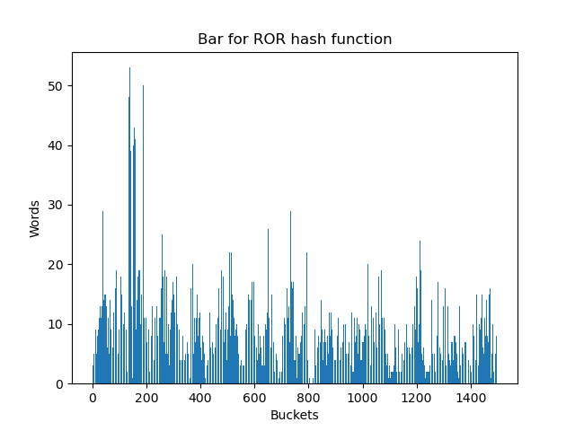
  <p><em>Рис 7. Ror hash</em></p>
  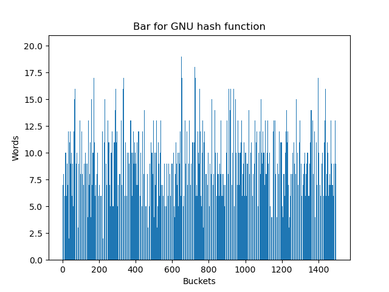
  <p><em>Рис 8. GNU hash</em></p>
  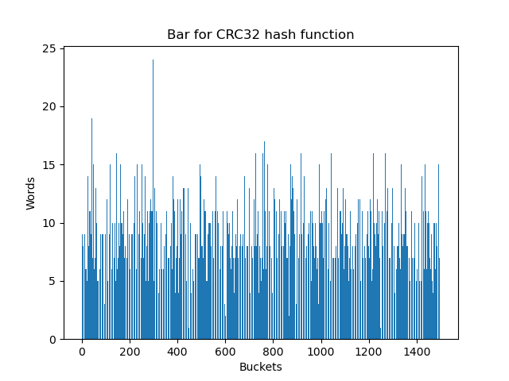
  <p><em>Рис 9. CRC32 hash</em></p>
</div>

Визуальный анализ не позволил выявить какие-либо значимые различия между ними. Для количественного анализа был произведен расчет дисперсий значений LoadFactor(таб. 1).

<center>


*Таб 1. Дисперсия для исследуемых функций*

| **Функция** | **Дисперсия** | 
| :---: | :---: | 
| *ROL* | 37.35 | 
| *ROR* | 46.40 |
| *GNU* | 9.06 |
| *CRC32* | 9.25 | 

</center>

Из полученных результатов можно сделать вывод, что более равномерным распределением обладают функции CRC32 и GNU. Однако, выбор сделан в пользу CRC32 за счет его аппаратной поддержки и математических свойств.

## Part 2: Конструирование хеш таблицы. Оптимизация средствами языка C и его компилятора.

### Структура хеш таблицы.

Для хранения данных был взят и немного изменен cache-friendly список(list), написанный в одной из предыдущих работ курса. Идея была в том, чтобы все данные обладали пространственной локальностью(однако это было не совсем корректным предположением, об этом будет изложено позжe), а память под всю таблицу выделялось в несколько аллокаций независимо от количества данных и корзин. С помощью предоставленного интерфейса пользователь мог бы выбрать свою хеш функцию, добавлять слова, получать ключи. 

### Тестирование хеш таблицы.

Для того, чтобы понимать, являлась ли оптимизация успешной необходимо ввести некоторую численную характеристику. В данном случае был взят тест сгенерированный следующим образом: брались два источника данных,
первый источник - книга о которой упоминалось ранее, второй источник - небольшой словарь из 10000 слов (подробнее в исходниках). Из этих источников случайно выбирались 10^6 слов, которые потом подавались на вход 
функции получения ключа в цикле. выполнения такого цикла записывалось в массив и процесс повторялся заново. Такие действия повторялись N раз, после чего значения усреднялись с учетом погрешности полученного значения.  
При этом тесты были достаточно большие, чтобы исключить время загрузки таблицы из памяти, запись в память и остальные добавочные расходы не связанные с самим тестированием.   

Само по себе время выполнения теста не представляет собой никакой ценной информации. Однако отношения времен при разных параметрах/оптимизациях является довольно информативной характеристикой. Поэтому в дальнейших 
оценках, расчетах была использована именно эта характеристика. 

О флагaх компиляции и характеристиках тестирующей машины можно почитать в [приложении](#appendix).

### Начало отсчета

Перед тем, как начинать замеры производительности, необходимо обозначить стартовую точку, относительно чего оптимизировать. Для этого был взят самый простой случай со всеми проверками. Программа компилировалась с разными флагами оптимизации
(-O0, -O1, -O2, -O3), тестировалась и среди результатов выбирался лучший. В таблице 2 представлены полученные результаты. 

<center>

*Таб 2. Результаты выполнения при разных флагах -O*

| **Флаг оптимизации** | **Время в тактах / 10^8** | **Относительное время** |
| :---: | :---: | :---: | 
| *-O0* | 11.97 +- 0.80% | 5.03 +- 0.07 | 
| *-O1* | 2.35 +- 0.88% | 0,99 +- 0.02 |
| *-O2* | 2.38 +- 0.98% | 1.00 +- 0.02| 
| *-O3* | 2.38 +- 1.02% | *Эталон* |

</center>

Такое огромное различие во времени выполнения связано с тем, что при флагах оптимизации выше, чем -O0 компилятор заменяет классический алгоритм CRC32 на его более оптимизированную табличную версию.

В качестве начала отсчета было взято время при компиляции с флагом -O3(в дальнейшем всегда использовался флаг компиляции -O3). 

## Оптимизация. Начало.

Все этапы оптимизации можно найти на разных ветках с соответсвующими названиями.

Для начала необходимо было сделать все горячие функции(хеш функции, функции работы со списком) inlined. Для этого код интересующих функции помещался в один исходник и в объявлении было добавлено ключевое слово inline.
Отключались все проверки на корректность аргумента в функциях получения значения в спискe. Размер таблицы фиксировался с помощью константы времени компиляции, чтобы функция получения номера корзины не обращалась 
к ячейке памяти со структурой лишний раз. Для возможных, но редких случаев например, случай с пустой корзиной, добавлялся атрибут [[unlikely]]. Полученные результаты представлены в таблице 3 в [приложении](#appendix).
Увеличение в **1.16 раза** является хорошим показателем при использовании только средств языка С и его компилятора.

## Part 3: Ручная оптимизация.

Перед тем, как начинать ручную оптимизацию, необходимо было сделать профилирование программы для того, чтобы узнать, что конкретно оптимизировать. Профилирование программы было сделано 
консольным профилировщиком perf, eго вывод представлен на рисунке 10.

<div align="center">
  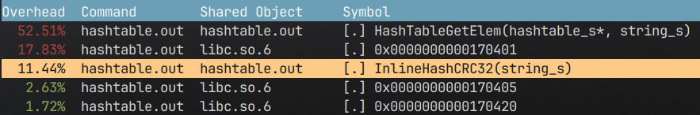
  <p><em>Рис 10. Снимок экрана в приложении профилировщика </em></p>
</div>

Оказалось, что больше всего времени занимала функция нахождения ключа HashTableGetElem. На рисунке 11 представлен вывод perf`a для функции HashTableGetElem.

<div align="center">
  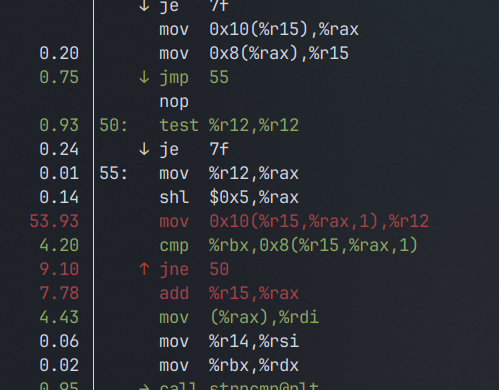
  <p><em>Рис 11. Функция  </em></p>
</div>

Чтение следующего элемента - самая горячая точка в этой функции(в последующем этот вопрос был частично решен). 

Было решено, что следующими оптимизациями будут использование Intel Intrinsics для подсчета хеш функции CRC32(точнее CRC32C) и написание своей версии strnlen с использованием векторных инструкций.

### Оптимизация CRC32

Для любого сценария использования хеш таблицы наиболее часто используемой функцией является хеш функция. В нашем случае вычисление хеш функции может быть оптимизировано при помощи аппаратной поддержки crc32. Процессоры обладающие расширением 
SSE 4.2 способны вычислять 32-х битный хеш за одну инструкцию. В листинге 1 приведен код оптимизированной функции.

``` C
static uint32_t
HashCRCIntrinsics(string_s elem)
{
    uint32_t hash = ~0u;

    for (size_t i = 0; i < elem.size; i++)
    {
        hash = _mm_crc32_u8(hash, (unsigned char) elem.string[i]);
    }

    return hash;
}
```

<center>

*Листинг 1. Код оптимизированной функции с использованием intrinsics.*

</center>

Прирост относительно эталонной версии программы в **1.22 раза**(+ 5% относительно предыдущей версии). Неплохой результат, учитывая, что еще не все оптимизации были применены.

Аналогичную версию программы можно написать с помощью ассемблерных вставок. Оптимизированный код приведен на листинге 2.

``` C 
static uint32_t
HashCRCASM(string_s elem)
{
    uint32_t hash = ~0u;

    for (size_t i = 0; i < elem.size; i++)
    {
        __asm__ volatile(
            "crc32 %[input], %[output]"
            : [output] "+r" (hash)
            : [input] "r" (elem.string[i])   
            );
    }

    return hash;
}
```

<center>

*Листинг 2. Код оптимизированной функции c использованием \_\_asm\_\_ volatile.*

</center>

Такая версия программы быстрее эталонной в **1.26 раза**(+9% относительное предыдущей версии). Это связано с тем, что компилятор разворачивает 
цикл с intrinsics, при этом теряя время на накладных расходах. В случае данных бОльшего размера, такая оптимизация оправдана, однако для слов порядка  $\approx 7$ символов это неактуально.

### Оптимизация strnlen 

Для оптимизации функции strnlen использовались векторные инструкции, которые поддерживаются расширением SSE 4.2.   

```assembly
ssestrncmp:
            cmp edx, 16
            jg .if_greater_16

            mov eax, edx                    
            vmovdqu xmm0, [rdi]         ; load from memory
            vpcmpestrm xmm0, [rsi], 24  ; compare string 
            setc al
            movzx eax, al
            ret

.if_greater_16:
            xor ecx, ecx
.loop:                                                          
            mov eax, edx
            vmovdqu xmm0, [rdi+rcx]
            vpcmpestrm xmm0, [rsi+rcx], 24
            setc al
            sub edx, 16
            add rcx, 16
            movzx eax, al
            test edx, edx
            jle .leave
            test eax, eax
            je .loop
.leave:

            ret

```

Такая оптимизация дала прирост в **1.35 раза**(+7% относительно предыдущей версии). Этот небольшой прирост связан с тем, что таблица 
содержит длину каждого элемента, и перед сравнением строк проверяется равенство длины каждого элемента, соответсвенно strnlen вызывается только 
в небольшом количестве случаев.

## Part 4: Возврат к истокам. Упорядочивание элементов хеш таблицы.

После ручной оптимизации профиль программы выглядит следующим образом(рис. 12).

<div align="center">
  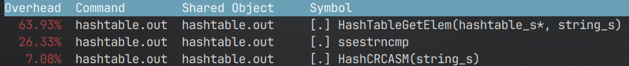
  <p><em>Рис 12.   </em></p>
</div>

Две остальные функции уже были изменены. Горячая точка в HashTableGetElem - получение индекса следующего узла. 
Как-то обойти процесс чтения без изменения структуры хеш таблицы, однако и сам процесс чтения можно оптимизировать.  

Ранее было сказано о том, что таблица создается в несколько аллокаций. Это конечно хороший тон в программировании, однако элементы раскиданы в списке 
хаотично, что плохо сказывается на локальность данных. При чтении последовательных узлов prefetcher процессора не способен предугадать следующее 
обращение к памяти. 

Для того, чтобы решить эту проблему, после инициализации таблицы вызывается функция для линеaризации списка. Т. е. текущий список переупорядочивается 
таким способом, чтобы последовательные элементы шли в большей степени последовательно. Тогда префетчер способен обнаружить паттерн обращения к памяти и 
загрузить в кеш следующий элемент списка.

Для подтверждения предположения с помощью perf stat было получено количество cache misses для разных версий программ с помощью следующей команды:

``` bash 
perf stat -e L1-dcache-load-misses,LLC-load-misses ./hashtable.out
```

Ниже представлен вывод данной команды для двух случаев.

```bash 
# Случай 1: без линеаризации списка
  Performance counter stats for './hashtable.out':

   <not supported>      cpu_atom/L1-dcache-load-misses/u
       872,786,650      cpu_core/L1-dcache-load-misses/u                                        (99.43%)
               173      cpu_atom/LLC-load-misses/u                                              (0.57%)
           520,804      cpu_core/LLC-load-misses/u                                              (99.43%)

       5.748415504 seconds time elapsed

       5.718990000 seconds user
       0.016915000 seconds sys

# Случай 2: с линеаризацией списка
  Performance counter stats for './hashtable.out':

   <not supported>      cpu_atom/L1-dcache-load-misses/u
       343,841,464      cpu_core/L1-dcache-load-misses/u                                        (99.73%)
                 0      cpu_atom/LLC-load-misses/u                                              (0.27%)
           414,091      cpu_core/LLC-load-misses/u                                              (99.73%)

       4.558457156 seconds time elapsed

       4.528614000 seconds user
       0.019873000 seconds sys
```

Количество cache-miss сократилось в более чем в **2 раза**, в то время как скорость выполнения текущей версии(по сравнению с эталонной) увеличилось 
в **1.71** (+29% относительно предыдущей версии). Следовательно, предположение подтверждено.

# Выводы

Хз что писать типа перфа 1.71 выросла лол я молодец. там еще таблица конечная в аппендиците 


## Appendix

### Характеристики тестирующей машины. Сборка.
 
Ниже предствлены харакетристики тестировочной системы(вывод neofetch):

``` c
                   -`                    pr1usf0x@archlinux
                  .o+`                   ------------------
                 `ooo/                   OS: Arch Linux x86_64
                `+oooo:                  Host: ASUS TUF Gaming F15 FX507ZC4_FX507ZC4 1.0
               `+oooooo:                 Kernel: 6.19.9-arch1-1
               -+oooooo+:                Uptime: 1 hour, 5 mins
             `/:-:++oooo+:               Packages: 1287 (pacman), 1 (dpkg), 6 (flatpak)
            `/++++/+++++++:              Shell: zsh 5.9
           `/++++++++++++++:             Resolution: 2560x1440
          `/+++ooooooooooooo/`           DE: Plasma 6.6.3
         ./ooosssso++osssssso+`          WM: kwin
        .oossssso-````/ossssss+`         Theme: Breeze-Dark [GTK2], Breeze [GTK3]
       -osssssso.      :ssssssso.        Icons: breeze-dark [GTK2/3]
      :osssssss/        osssso+++.       Terminal: alacritty
     /ossssssss/        +ssssooo/-       CPU: 12th Gen Intel i5-12500H (16) @ 4.500GHz
   `/ossssso+/:-        -:/+osssso+-     GPU: Intel Alder Lake-P GT2 [Iris Xe Graphics]
  `+sso+:-`                 `.-/+oso:    GPU: NVIDIA GeForce RTX 3050 Mobile
 `++:.                           `-/+/   Memory: 7090MiB / 15604MiB
 .`                                 `/


```

Все измерения были проведены в диапазонах температур ядер порядка 50-60°C (в таком диапазоне троттлинг не происходит). Так как тестировочная машина - ноутбук, все замеры происходили при подключенном питании. Для компиляции исходников был использован компилятор clang версии 22.1.2. Для ассемблирования исходников .asm был использован кроссплатформенный 
ассемблер nasm. Ниже указаны флаги использованные флаги компиляции для .cpp исходников:

``` C
-D NDEBUG -std=c++17 -(флаг(и) оптимизации) -mavx2
```

### Полученные результаты 

| **Версия программы** | **Время в тактах / 10^8** | **Относительная скорость**(прирост по сравнению с предыдущей оптимизацией) |
| :---: | :---: | :---: | 
| *Без оптимизаций* | 2.38 +- 0.98% | Эталон(1.00) |
| *Оптимизация с помощью компилятора* | 2.06 +- 0.69% | 1.16 +- 0.01 (+16%)| 
| *Оптимизация crc32 с использованием Intel Intrinsics* | 1.95 +- 1.42% | 1.22 +- 0.02 (+5%)|
| *Оптимизация crc32 c использованием \_\_asm\_\_ volatile* | 1.89 +- 1.96% | 1.26 +- 0.03 (+9%) |
| *Оптимизация strnlen* | 1.76 +- 0.59% | 1.35 +- 0.02 (+7%)|
| *Переупорядочивание элементов в списке* | 1.39 +- 0.73% | 1.71 +- 0.02 (+29%)|
